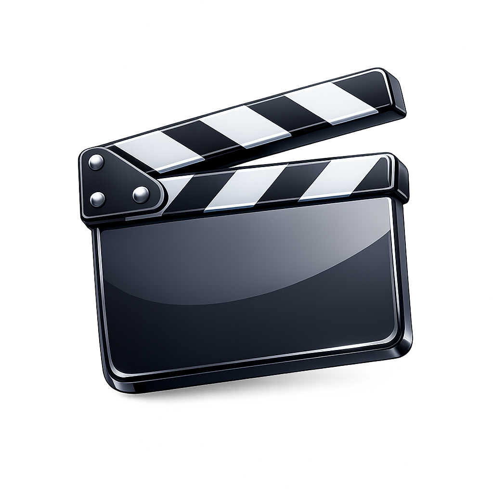
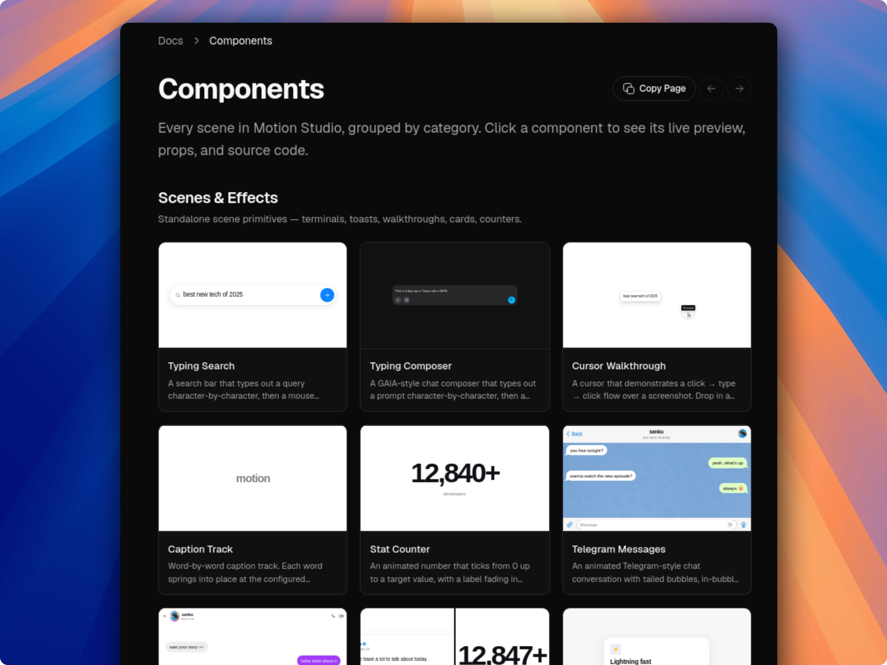

<p align="center">
  
</p>

<h1 align="center">Motion Studio</h1>

<p align="center">
  An open-source library of animated video primitives, plus a browser studio to assemble them — built on <a href="https://www.remotion.dev">Remotion</a>.
</p>

<p align="center">
  By <a href="https://github.com/theexperiencecompany">TheExperienceCompany</a>
</p>

<p align="center">
  
</p>

<p align="center">
  
</p>

---

## What this is

A set of high-quality, animated video scenes — every scene is a single React component you can copy into your own project. On top of that lives a browser-based **Studio** for stitching scenes on a timeline, configuring per-clip styling and transitions, and exporting to MP4.

No SDK. No install. The library and the studio share the same scene registry, so anything you see in the docs is one click away from being on a timeline.

## Two ways to use it

- **You drive it.** Open the Studio, pick scenes from the Library, edit props in the Inspector, set transitions, hit Export.
- **An agent drives it.** Every scene has a typed props interface that AI coding agents (Claude Code, Codex, Cursor) read trivially. Tell an agent "build me a 12-second SaaS launch reel" and it composes `TitlePopup` → `Terminal` → `BarChart` → `Toast` → `LogoCloud` for you.

## What's inside

- **70+ scenes** — text animations, animated charts (bar / line / area / pie / radar / radial), brand-locked chat (iMessage, WhatsApp, Slack, Discord, Telegram, Instagram), tweets, frame mockups (phone / laptop / browser), feature & pricing cards, terminal, toast, GitHub star button, and more.
- **Universal style controls** — every non-brand-locked scene exposes background / text / font / accent so you can match a brand kit in seconds.
- **Per-clip transitions** — fade, swipe, zoom between scenes.
- **Stackable effects** — fade-out, slide-out, Ken Burns, zoom-out layered on top of any clip.
- **Project save / load** as JSON, plus MP4 export.

## Repo layout

```
apps/
  web/        Next.js app — the Studio, docs, and registry-driven pages
  remotion/   Remotion compositions (every scene lives here)
packages/
  ui/         Shared shadcn/ui components
```

## Getting started

```bash
bun install
bun run --cwd apps/web dev
```

Then open [http://localhost:3000/studio](http://localhost:3000/studio).

## License

MIT.
